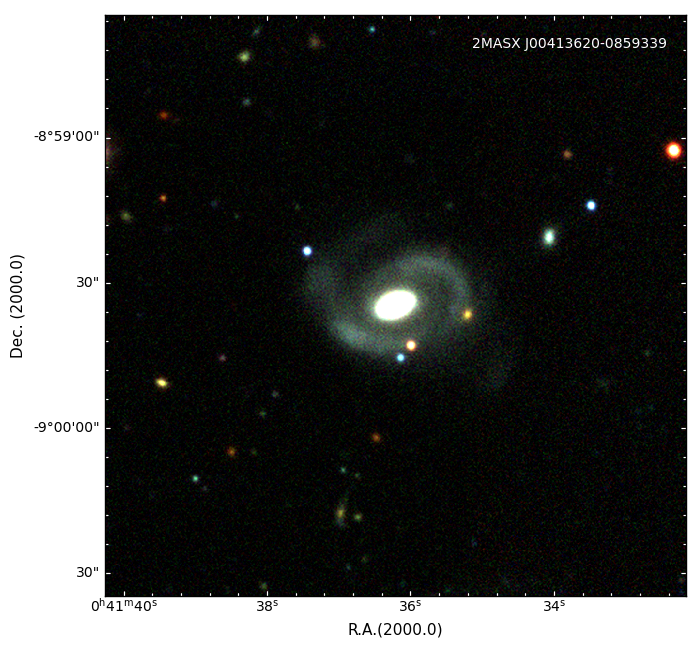
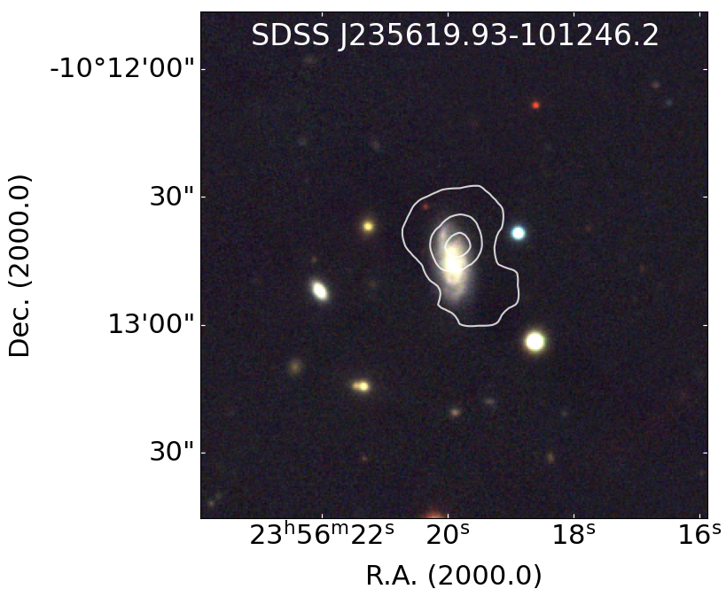

# Plot-tests-with-APLpy
The project contains example tests using the __APLly__ module which is an Astronomical Plotting Library in Python to produce astronomical plots using astronomical imaging data in FITS format. Furthermore, the example tests use modules like __Matplotlib__, which is amply used in graphics production with Python; __Numpy__, and __Astropy__.

More information on the modules used:
+ [__APLpy__](https://aplpy.github.io/index.html)
+ [__Matplotlib__](https://matplotlib.org/)
+ [__Numpy__](https://numpy.org/)
+ [__Astropy__](https://www.astropy.org/)

Examples:

The output image in __Test_Galaxies_color_Aplpy.py__ code.

:--:
*The 2MASX J00413620-085933 galaxy in zrg color.* 

The output image in __Test_Galaxy_color_overlay_contours_Aplpy.py__ code. The SDSS J235619.93-101246.2 galaxy in irg color with [HI](https://en.wikipedia.org/wiki/Hydrogen_line) contours.

Note: Both images were taken from [López-Gutiérrez, M. M. et al., 2022](https://ui.adsabs.harvard.edu/abs/2022MNRAS.517.1218L/abstract)
